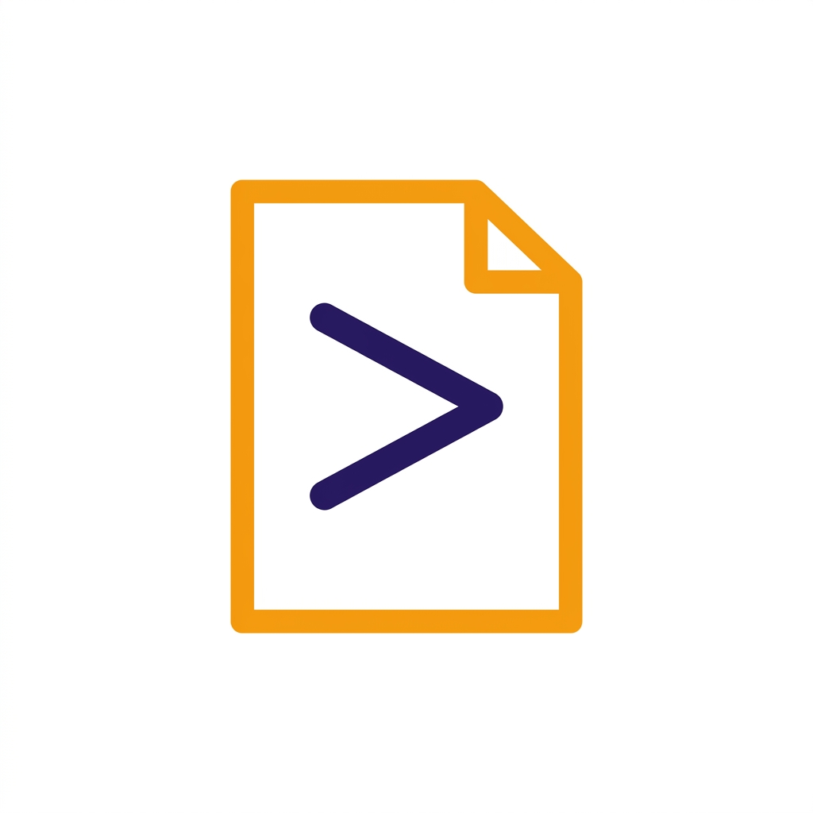
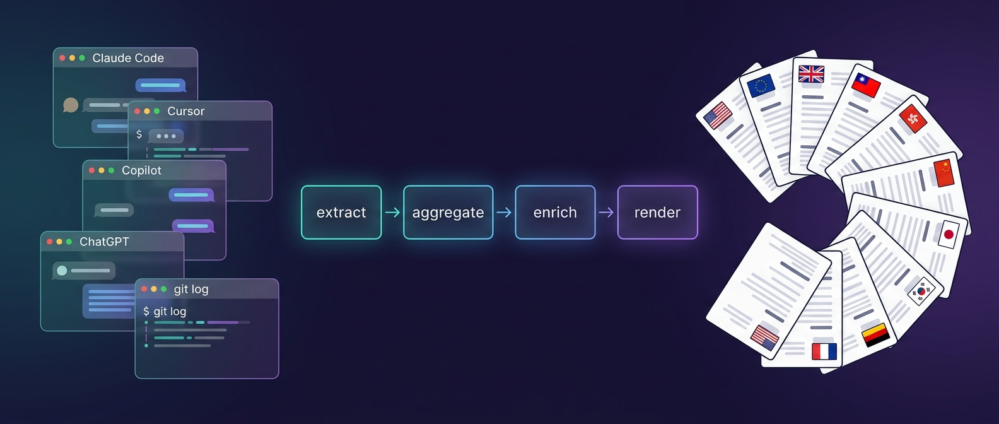
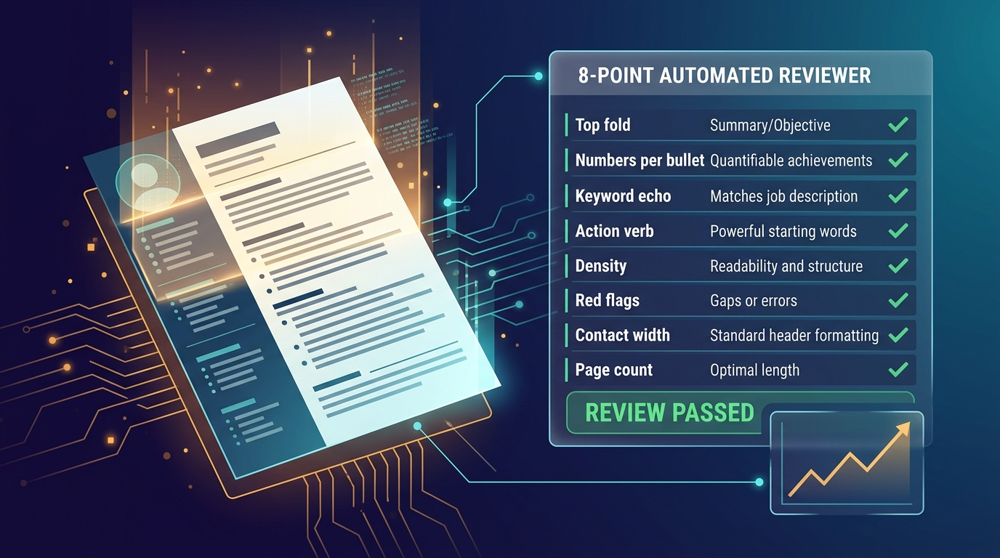

<p align="center">
  
</p>

<p align="center">
  <a href="README.md">English</a> ·
  <strong>繁體中文</strong> ·
  <a href="README.zh-CN.md">简体中文</a> ·
  <a href="README.ja.md">日本語</a>
</p>

# vibe-resume

> 把你的 AI 協作紀錄變成可版本化、可審核的履歷 —— **for the vibe coding era**。

[](https://github.com/easyvibecoding/vibe-resume/actions/workflows/tests.yml)
[](LICENSE)
[](https://www.python.org/downloads/)
[](docs/resume_locales.md)
[](https://github.com/astral-sh/uv)



`vibe-resume` 掃描你 macOS 上使用過的每一個 AI 助理(Claude Code、Cursor、GitHub Copilot、Cline、Continue、Aider、Windsurf、Zed AI,以及 ChatGPT / Claude.ai / Gemini / Grok / Perplexity / Mistral 的雲端匯出,還有 ComfyUI、Midjourney、Suno、ElevenLabs 與你的 `git` commits),將使用軌跡整合成 **Markdown / DOCX / PDF 履歷**,並內建 git 快照讓每一版草稿都能 diff 與回溯。

## 與其他工具的差異

| | vibe-resume | Reactive Resume / OpenResume | Resume-LM / Resume Matcher | HackMyResume / JSON Resume |
|---|---|---|---|---|
| **主要訊號源** | AI 工具會談 + git commits(自動擷取) | 使用者手填的 WYSIWYG 內容 | 上傳 PDF + JD | 使用者手寫 JSON |
| **Locale 數** | **10** (en_US/en_EU/en_GB/zh_TW/zh_HK/zh_CN/ja_JP/ko_KR/de_DE/fr_FR) 含文化專屬排版 | 1–2 | 1 | 依 theme 而定 |
| **日本 JIS Z 8303 履歴書格** | ✅ `render/japan.py` | ❌ | ❌ | ❌ |
| **Europass 帶標籤個人資料** | ✅ `en_EU` 模板 | ❌ | ❌ | ❌ |
| **履歷審核器** | 8 項評分表 + 趨勢稀疏圖 | — | 只有 ATS 分數 | — |
| **JD 客製化** | `enrich --tailor JD.txt`(LLM prompt 注入) | — | ✅ LLM 重寫 | — |
| **隱私** | 全本地;`claude -p` 無頭模式,資料不出本機 | 視情況(OpenAI key 可選) | 必須雲端 API | 全本地 |
| **形態** | Python CLI pipeline | Web UI | Web UI | Node CLI |
| **Agent-Skill 相容 host 數** | **8**(Claude Code · Gemini CLI · Copilot CLI · Cursor · Warp · OpenClaw · OpenCode · Hermes)—— 單一 canonical SKILL.md | — | — | — |

## 為什麼

2026 年的招募青睞能**用量化成果證明 AI 協作生產力**的工程師,而非僅在履歷上列出「Claude Code」作為技能。審核者想看到架構決策、跨棧廣度(前端 / 後端 / DevOps / 除錯 / 部署),以及你交付的速度。而你的 AI 工具其實已經自動記錄了這一切。`vibe-resume` 把這些「使用痕跡」轉成可用的佐證。

## 功能

### 本地 extractor(免登入)
| 來源 | 路徑 |
|---|---|
| Claude Code | `~/.claude/projects/**/*.jsonl` |
| Claude Code Archive | `~/ClaudeCodeArchive/current`(可選 rsync 備份) |
| Cursor | `~/Library/Application Support/Cursor/User/**/state.vscdb` |
| GitHub Copilot (VS Code) | `workspaceStorage/**/chatSessions/` |
| Cline | `globalStorage/saoudrizwan.claude-dev/` 或 `~/.cline/data/` |
| Continue.dev | `~/.continue/sessions/` |
| Aider | `$HOME/**/.aider.chat.history.md` |
| Windsurf / Cascade | `~/.codeium/windsurf/cascade/` |
| Zed AI | `~/.local/share/zed/threads/` |
| Claude Desktop | MCP 設定 + extensions |
| Git commits | `$HOME` 裡所有 `.git`,以你的 author email 過濾 |

### 雲端匯出匯入器(將 ZIP 丟到 `data/imports/<tool>/`)
ChatGPT · Claude.ai · Gemini Takeout · Grok · Perplexity · Mistral Le Chat · Poe

### AIGC extractor
`image_local`(ComfyUI / A1111 PNG metadata)· `midjourney`(IPTC/XMP)· `elevenlabs`(history API)· `suno`(本地 MP3 ID3)· `runway` / `heygen`(stub)

### 履歷智能處理
- **任務類別分類器** —— 把每次會談標註為 frontend / backend / bug-fix / deployment / refactor / testing 等類
- **能力廣度** —— 計算每個專案的相異類別數,凸顯跨技能工程師
- **30 天滾動統計** —— 活躍天數比、每日平均、高峰日、最長連續天(對齊 Claude Code 30 天清理週期)
- **XYZ enricher** —— 透過 Claude Code CLI 無頭模式把雜訊活動轉成 Google 風格履歷條目
- **技術棧規範化** —— `postgres` → `PostgreSQL`、`tailwind` → `Tailwind CSS`
- **硬技能 vs 領域標籤分離** —— 讓 ATS 關鍵字保持乾淨
- **隱私過濾** —— regex 遮蔽 + 專案黑名單 + 可選技術抽象化
- **版本化輸出** —— `data/resume_history/` 下的內部 git repo,含 `list-versions` / `diff v1 v2` / `rollback`

## 以 Agent Skill 形式使用(Claude Code · Gemini CLI · Copilot CLI · Cursor · Warp · OpenClaw · OpenCode · Hermes)

本 repo 同時是 **Agent Skill**。`description` frontmatter 符合使用者提問時,host 會自動載入整份 SKILL.md 並依指示執行完整 pipeline。

| Host | 探索路徑 | 本 repo 的設定 |
|---|---|---|
| **Claude Code** | `.claude/skills/<name>/SKILL.md` | Canonical —— 自動載入 |
| **Gemini CLI**(Google) | `.gemini/skills/<name>/SKILL.md` | 已以 symlink 指向 canonical |
| **GitHub Copilot CLI** | 原生讀 `.claude/skills/`(2026-04 changelog) | 零設定 |
| **Cursor CLI** | `AGENTS.md` + `.cursor/rules/` | `AGENTS.md` 指向 SKILL.md |
| **Warp**(agentic terminal) | 讀 `.claude/skills/` + `.agents/skills/` + `.warp/skills/` | 零設定;已補 `.agents/skills/` symlink |
| **OpenClaw**(250k⭐) | `~/.openclaw/skills/`(僅 user scope) | 需 user-scope symlink |
| **OpenCode**(終端 CLI agent) | `.opencode/skills/` + `~/.opencode/skills/` | 已含 project-scope symlink |
| **Hermes Agent**(Nous Research) | repo `skills/<name>/SKILL.md` → 裝到 `~/.hermes/skills/<category>/<name>/` | 原生 skill 在 [`skills/ai-used-resume/SKILL.md`](skills/ai-used-resume/SKILL.md);走 `hermes skills tap add` + `hermes skills install` |

### 安裝 —— 三條生態血統

2026 年 agent-skills 生態已收斂成**三條安裝路徑** —— 依你的 agent 選一條,不用再寫八條 `ln -s`。

**Tier 1 —— 27+ 家 `agentskills.io` 標準 host(一行裝到全部)**
```bash
npx skills add easyvibecoding/vibe-resume --skill ai-used-resume
```
`npx skills` 會自動偵測機器上裝了哪些 CLI / IDE agent,並路由到對應目錄。這一行就涵蓋 Claude Code、Cursor、Windsurf、Gemini CLI、GitHub Copilot、Codex、Qwen Code、Kimi Code、Roo Code、Kilo Code、Goose、Trae、OpenCode、Amp、Antigravity 等等。要限定特定 agent,加 `-a <slug>`:
```bash
npx skills add easyvibecoding/vibe-resume -a claude -a cursor-agent -a windsurf
```

<details>
<summary>Tier-1 完整 agent slug 對照表(<code>-a</code> 參數用)</summary>

| Agent | slug |  | Agent | slug |
|---|---|---|---|---|
| Amp | `amp` |  | Kilo Code | `kilocode` |
| Antigravity | `agy` |  | Kimi Code | `kimi` |
| Auggie CLI | `auggie` |  | Kiro CLI | `kiro-cli` |
| Claude Code | `claude` |  | Mistral Vibe | `vibe` |
| CodeBuddy CLI | `codebuddy` |  | opencode | `opencode` |
| Codex CLI | `codex` |  | Pi Coding Agent | `pi` |
| Cursor | `cursor-agent` |  | Qoder CLI | `qodercli` |
| Forge | `forge` |  | Qwen Code | `qwen` |
| Gemini CLI | `gemini` |  | Roo Code | `roo` |
| GitHub Copilot | `copilot` |  | SHAI (OVHcloud) | `shai` |
| Goose | `goose` |  | Tabnine CLI | `tabnine` |
| IBM Bob | `bob` |  | Trae | `trae` |
| iFlow CLI | `iflow` |  | Windsurf | `windsurf` |
| Junie | `junie` |  |  |  |

最新清單請查 [vercel-labs/skills](https://github.com/vercel-labs/skills)。
</details>

**Tier 2 —— OpenClaw(自有 ClawHub marketplace + 5,400+ skill registry)**
```bash
openclaw skills install easyvibecoding/vibe-resume/ai-used-resume
```

**Tier 3 —— Hermes Agent(自有 `skills.sh` registry + 原生 5-section body 格式)**
```bash
hermes skills tap add easyvibecoding/vibe-resume
hermes skills install easyvibecoding/vibe-resume/ai-used-resume --force --yes
```

<details>
<summary>手動安裝 / symlink 備援(沒裝 Node、路徑客製、Windows)</summary>

若不想用 `npx skills`,或需要完全控制 symlink 位置:

```bash
# Tier 1 host —— 從 repo canonical SKILL.md symlink 出去
mkdir -p ~/.claude/skills && ln -s "$(pwd)/.claude/skills/ai-used-resume" ~/.claude/skills/ai-used-resume
mkdir -p ~/.gemini/skills && ln -s "$(pwd)/.claude/skills/ai-used-resume" ~/.gemini/skills/ai-used-resume
mkdir -p ~/.warp/skills && ln -s "$(pwd)/.claude/skills/ai-used-resume" ~/.warp/skills/ai-used-resume
mkdir -p ~/.opencode/skills && ln -s "$(pwd)/.claude/skills/ai-used-resume" ~/.opencode/skills/ai-used-resume

# Cursor 讀 project root 的 AGENTS.md 零設定。要跨專案用就複製到 ~/.cursor/rules/。
```

Windows(管理員 PowerShell):
```powershell
New-Item -ItemType SymbolicLink -Path $HOME\.claude\skills\ai-used-resume `
  -Value (Resolve-Path .claude\skills\ai-used-resume)
# .gemini / .warp / .opencode 同樣處理
```
</details>

### 安裝後怎麼觸發

**所有 2026 host 都**支援 `description` 比對自動觸發 —— 自然語言就夠,例如:**「幫我從 AI 使用紀錄產生履歷」**、**「渲染成日文履歷」**、**「針對這份 JD 客製履歷」**、**「評分我的履歷」**、**「秀履歷分數趨勢」**。多數 host 同時提供顯式呼叫:

| Host | 自動觸發 | 顯式呼叫 |
|---|---|---|
| **Claude Code** | ✅ 靠 `description` 比對 | `/ai-used-resume` slash command |
| **Gemini CLI** | ✅ `activate_skill` 工具載入 | 安裝後在 REPL 跑一次 `/agents refresh` 建索引 |
| **GitHub Copilot CLI** | ✅ description 比對 | `gh skill install easyvibecoding/vibe-resume` |
| **Cursor CLI** | ✅ project root 的 `AGENTS.md` 自動生效 | 內容也可複製到 `.cursor/rules/` |
| **Warp** | ✅ agent 會從可用 skill 清單挑 | `/ai-used-resume` 或搜尋 skill 選單 |
| **OpenClaw** | ✅ 載入時比對 description | `/ai-used-resume` 或 `openclaw skills install` |
| **OpenCode** | ✅ 內建 `SkillTool` | `/ai-used-resume` slash command |
| **Hermes Agent** | ✅ description 比對 | `hermes chat -s ai-used-resume -q "幫我產生履歷"` 預載形式 |

快速驗證安裝是否成功,丟這句給任一 host:**「不用真的跑,只要依序描述從 AI 使用紀錄產生履歷需要哪 6 個指令」**。回應若能說出 `extract → aggregate → enrich → render → review → trend` 並用 `uv run vibe-resume` 語法,代表 skill 已正確載入(已在 Hermes 透過 `hermes chat -Q -s ai-used-resume` 實測驗證)。

## 快速上手

```bash
# 1. 安裝
uv venv && uv pip install -e ".[dev]"

# 2. 填入個人檔
cp profile.example.yaml profile.yaml
$EDITOR profile.yaml        # 至少填 name / target_role
# config.yaml 不存在時會首跑自動從 config.example.yaml bootstrap

# 3. (可選)把雲端 ZIP 匯出丟到 data/imports/<tool>/

# 4. 跑 pipeline
uv run vibe-resume extract          # 4× 並行 extract + 進度條
uv run vibe-resume aggregate        # 依專案分組 + 推斷技術棧
uv run vibe-resume enrich           # 透過 claude -p 產生 XYZ bullet
uv run vibe-resume render -f all    # md + docx + pdf + git 快照
```

## 指令

| 指令 | 功能 |
|---|---|
| `cli.py extract [--only NAME]` | 執行 extractor,快取到 `data/cache/*.json` |
| `cli.py aggregate` | 依專案分組、分類任務、推斷技術棧 |
| `cli.py enrich [-n N] [--locale L] [--tailor JD.txt]` | 產生 summary + achievements(英文用 XYZ、中日德法韓用名詞片語);`--tailor` 讓 bullet 偏向 JD 關鍵字 |
| `cli.py render -f md\|docx\|pdf\|all [--locale L]` | 渲染 + git 快照 |
| `cli.py render --all-locales [-f FMT]` | 一次渲染所有已註冊 locale |
| `cli.py render --tailor data/imports/jd.txt` | 針對特定 JD 客製 |
| `cli.py review [-v N \| --file PATH] [--locale L] [--jd JD.txt]` | 以 8 項 reviewer 檢查表評分 |
| `cli.py trend [--locale L]` | 依 locale 顯示歷次評分 + 平均 + 最新等第 |
| `cli.py completion {bash\|zsh\|fish} [--install]` | 產生或安裝 shell 補全腳本 |
| `cli.py status` | 顯示各來源的活動數量 |
| `cli.py list-versions` / `cli.py diff 1 2` | 履歷版本歷史 |

## 多語 locale 渲染

`vibe-resume` 內建每個 locale 專用模板,讓同一份 `profile.yaml` 與專案資料能渲染成各地區審核者習慣的版型。

**示範輸出請見 [`docs/samples/`](docs/samples/README.md)**:`en_EU`(Europass)、`ja_JP`(職務経歴書)、`zh_TW`(繁中)三份對照範例。

```bash
uv run python cli.py render -f md  --locale en_US     # ATS 優化美式預設
uv run python cli.py render -f md  --locale zh_TW     # 台灣繁中履歷
uv run python cli.py render -f all --locale ja_JP     # 履歴書 (DOCX 格子) + 職務経歴書 (md/pdf)
uv run python cli.py render -f md  --locale de_DE     # Lebenslauf 含 Persönliche Daten 區塊
```

| Locale | 風格 | 照片 | 標題範例 | 特殊點 |
|---|---|---|---|---|
| `en_US`(預設) | XYZ 動詞開頭 | 禁用 | Summary / Skills / Experience / … | 扁平 ATS 友善技能行 |
| `en_EU` | XYZ 動詞開頭 | 可選 | Personal information / Work experience / Education and training / … | Europass 版面 —— 帶標籤個人資料列,CEFR 語言,GDPR 極簡(預設不露 DOB) |
| `en_GB` | XYZ 動詞開頭 | 禁用 | Personal statement / … | 英式拼寫、CEFR |
| `zh_TW` | 名詞片語 | 可選 | 自我介紹 / 技能專長 / 工作經歷 / … | 全形分隔,中英技術混排 |
| `zh_HK` | 名詞片語 | 可選 | Personal Profile 個人簡介 / Work Experience 工作經驗 / … | **雙語標題 EN + 繁**;CEFR;不放 HKID |
| `zh_CN` | 名詞片語 | 可選 | 个人简介 / 专业技能 / … | 簡體、大廠偏美式 |
| `ja_JP` | 名詞片語 | **必備** | 職務要約 / 職務経歴 / … | DOCX = JIS Z 8303 履歴書格子(`render/japan.py`);md = 職務経歴書 |
| `ko_KR` | 名詞片語 | **必備** | 자기소개 / 보유 기술 / 경력 / … | 자기소개서 以獨立文件處理 |
| `de_DE` | 名詞片語 | **必備** | Persönliche Daten / Berufserfahrung / … | 填了 `dob` / `nationality` 才會輸出 |
| `fr_FR` | 名詞片語 | 可選 | Profil / Compétences / Expérience / … | 資淺 1 頁、資深 2 頁 |

### 各 locale 文字覆寫

`UserProfile` 是 `extra="allow"`,所以任何 `<field>_<locale>` key 都可以與英文原欄位並存,模板會用 `localized` Jinja filter 挑正確的版本:

```yaml
title: "Senior Full-stack Engineer"
title_zh_TW: "資深全端工程師"
title_ja_JP: "シニアフルスタックエンジニア"

summary: "Full-stack engineer who…"
summary_zh_TW: "全端工程師,熟悉 React / Next.js…"

experience:
  - title: "Senior Full-stack Engineer"
    title_zh_TW: "資深全端工程師"
    company: "Lumen Labs"
    company_zh_TW: "Lumen Labs(種子輪 AI SaaS)"
    bullets:
      - "Reduced query latency from 1.8s to 620ms..."
    bullets_zh_TW:
      - "查詢中位延遲從 1.8 秒降至 620 毫秒…"
```

選填的 locale 條件個人欄位(`dob` / `gender` / `nationality` / `mil_service` / `photo_path` / `marital_status`)在 `profile.example.yaml` 有完整說明。只有當 (a) 當前 locale 的 `personal_fields` 包含該欄,且 (b) 值不為空,這些欄位才會輸出。

完整設計理由與各 locale 欄位對應矩陣放在 `docs/resume_locales.md`。

### Locale 解析鏈

渲染器依下列四個來源判斷 locale,遇到第一個有值的就停:

1. CLI 的 `--locale`(最高)
2. `profile.yaml` 的 `profile.preferred_locale`
3. `config.yaml` 的 `config.render.locale`
4. `en_US` fallback

```yaml
# profile.yaml —— 若 CLI 沒覆寫就一律渲染 ja_JP
preferred_locale: ja_JP

# config.yaml —— 團隊預設
render:
  locale: en_US
  all_locales_formats: ["md", "docx"]   # --all-locales 每個 locale 的格式
```

`cli.py render --locale zh_TW` 永遠勝過 `preferred_locale`;省略 `--locale` 則由 `preferred_locale` 接手。`enrich` 呼叫 LLM 時也走同一條鏈,確保語言標籤正確注入。

### 一次渲染所有 locale

需要為各地區打包完整版時:

```bash
uv run python cli.py render --all-locales                 # 使用 config.render.all_locales_formats
uv run python cli.py render --all-locales -f docx         # 強制特定格式
uv run python cli.py render --all-locales --tailor jd.txt # 一份 JD 應用到所有 locale
```

`--all-locales` 會走完 `LOCALES` 註冊表(目前 10 個)。每個 locale 輸出的格式由 `config.render.all_locales_formats` 控制(預設 `["md"]`),改成 `["md", "docx", "pdf"]` 就能一次產齊全部包。`--locale` 與 `--all-locales` 互斥。

## Reviewer persona(`--persona`)

能過 Tech Lead 關的履歷,在 HR 初篩可能直接被過濾,反之亦然。`--persona` 加入第 3 個軸(locale 是語言、`--tailor` 是 JD,persona 是**預期讀者角色**),改的是 bullet 的語氣、重點、術語密度 —— 同樣的活動資料、同樣的 locale,換個讀者就重新發聲。

| Key | 讀者 | 這種讀者在掃什麼 |
|---|---|---|
| `tech_lead` | Staff+ 工程師 / 技術主管 | 具名系統、具體效能數字、權衡類動詞(*migrated / replaced / introduced*) |
| `hr` | HR / 招募專員 | 職涯軌跡、跨職能合作、平易近人的業務影響;滿版縮寫會被跳過 |
| `executive` | VP / 業務決策者 | 業務產出(營收、成本、團隊規模、市場覆蓋);每段 role 的首 bullet 要像「標題」 |
| `startup_founder` | 新創創辦人(A 輪前) | 端到端擁有、出貨速度、資源意識;企業流程式描述會被打折 |
| `academic` | 學術 / 研究審查委員 | 方法論嚴謹性、資料集、benchmark、citation 式框架 |

3 個軸可自由組合:

```bash
# 同一個人、3 種讀者、日本市場
uv run vibe-resume enrich --persona tech_lead --locale ja_JP -n 3
uv run vibe-resume review  --persona tech_lead --locale ja_JP

uv run vibe-resume enrich --persona hr        --locale ja_JP -n 3
uv run vibe-resume review  --persona hr        --locale ja_JP

# Executive 視角 + JD 客製 + 英文
uv run vibe-resume enrich --persona executive --tailor data/imports/jd.txt --locale en_US -n 3
uv run vibe-resume review  --persona executive --jd data/imports/jd.txt
```

Persona 不捏造 —— 只是換語氣、換重點。原始資料沒支撐的數字、人名、決策都不會冒出來。`review --persona` 會在計分表末尾附上該 persona 的審查視角建議。

## 策略性履歷 —— 目標企業 profile(`--company`、`--level`)

內建 70 家公司 profile 與 6 個職涯層級原型,讓 enrich + review 可針對特定雇主的招募標準客製 —— 與 locale、persona、JD tailor 正交。每份 profile 放在 `core/profiles/<key>.yaml`,並帶有事實查核時間 (`last_verified_at`),過期資料會在套用時明確警告,不會悄悄汙染履歷。

**瀏覽內建目錄:**

```bash
# 依 tier 分組 —— frontier_ai / ai_unicorn / regional_ai / tw_local /
# us_tier2 / eu / jp / kr
uv run vibe-resume company list
uv run vibe-resume company list --tier jp

# 查看完整 profile(must-haves、red flags、keyword anchors、
# enrich_bias、review_tips、最後查核日期)
uv run vibe-resume company show openai

# 70 家 age 表 —— 標記超過 90 天閾值者
# (對應當前 AI 招募市場的季度刷新節奏)
uv run vibe-resume company audit
uv run vibe-resume company audit --only-stale --stale-days 30
```

**enrich + review 套用公司與層級:**

```bash
# 針對 OpenAI senior IC 客製履歷
uv run vibe-resume enrich  --company openai --level senior --locale en_US -n 3
uv run vibe-resume render  -f all --locale en_US
uv run vibe-resume review  --company openai --level senior --locale en_US

# 同一份活動、不同雇主 —— review 會在 8 項基本 rubric 之上
# 追加一個企業特定的 "Company keyword coverage" 分數 (0/10)
uv run vibe-resume review  --company anthropic --level senior --locale en_US
uv run vibe-resume review  --company rakuten  --level senior --locale ja_JP
```

**每次套用 `--company` 都會自動檢查查核日期。** Profile 超過 90 天,CLI 會印紅字警告並提示更新路徑 —— 絕不靜默使用過期研究資料汙染履歷。

**更新過期 profile:**

```bash
# 委派事實查核給 claude CLI agent(近期 ≤90 天 + 近年 2-3 年雙軌交叉驗證)
# 報告存於 data/verification_reports/<key>_<YYYY-MM-DD>.md
uv run vibe-resume company verify openai

# 若 agent 回傳 VERDICT: clean,自動更新查核日期
uv run vibe-resume company verify openai --apply

# 若已手動用瀏覽器確認過,直接 bump 日期
uv run vibe-resume company mark-verified openai
uv run vibe-resume company mark-verified openai --date 2027-01-15 --yes
```

`mark-verified` 只改 YAML 那一行日期,保留註解、折疊字串、其他所有手動修改。新增全新 profile 也是 drop-in:寫一份 `core/profiles/<key>.yaml` 並設 `last_verified_at: "YYYY-MM-DD"`,立刻被 loader 註冊、打包進 wheel、可被 `--company` 消費。

職涯層級(`--level`):`new_grad` · `junior` · `mid` · `senior` · `staff_plus` · `research_scientist`。每個原型內建該層級 reviewer 期待看到的 lead-bullet 訊號,避免把 mid 的任務膨脹成 staff 都守不住的 scope claim。

## Reviewer-view 審核(`cli.py review`)



渲染完之後,用與真 reviewer 一致的 8 項清單評分:

```bash
uv run python cli.py review                    # 最新版
uv run python cli.py review -v 9               # 指定版本
uv run python cli.py review -v 12 --jd jd.txt  # 加入 JD 關鍵字覆蓋率
```

每份草稿按以下 8 項評:

1. **Top fold** —— 姓名、目標角色、至少一個具體指標是否出現在前 12 行
2. **Numbers per bullet** —— 工作經歷的 bullet 中是否 ≥60% 帶有量化指標
3. **Keyword echo (JD)** —— JD 的主要大寫詞彙是否被履歷重現(無 `--jd` 則略過)
4. **Action-verb first** —— XYZ locale 下,bullet 是否以過去式動詞開頭
5. **Density (noun-phrase)** —— 名詞片語 locale 下,bullet 是否自給自足、無懸空代詞
6. **Red flags** —— 依 locale 檢查照片 / DOB / "References available upon request" / 連續標題等
7. **Contact line width** —— 首行 contact 是否會換行崩版(中日韓字元雙寬)
8. **Page count** —— 依行數與 wrap 估計總頁數 vs locale 建議(US/UK ≤2、DE/JP/KR ≤3)

輸出 `data/reviews/<draft>_review.md` 與 `.json` 可跨版 diff。送出真 reviewer 前建議至少拿到 B/(80%) 等第。

### 評分趨勢(`cli.py trend`)

每次 review 都會在 `data/reviews/` 留下 JSON 檔,`trend` 把它們依 locale 摺疊成一份總覽,讓你看出每個市場版本是在進步還是退步:

```bash
uv run python cli.py trend               # 所有 locale
uv run python cli.py trend --locale zh_TW
```

```
 Locale  Runs  First    Latest        Mean    Grade  Trend
 en_US   6     58/80    v16: 78/80    91.0%   A      ▂▅▆▇██
 ja_JP   3     50/80    v14: 72/80    82.5%   A      ▁▅█
 zh_TW   4     42/80    v15: 74/80    85.0%   A      ▁▃▆█
```

稀疏圖用 U+2581..U+2588 Unicode block,任何 monospace 終端機都能渲染。欄位:跑幾次、第一次分數、最新分數(含版號)、跨版平均百分比、最新等第、逐次趨勢。

## Claude Code 30 天清理 —— 重要

Claude Code 預設會刪除超過 30 天的 session JSONL 檔。要長期保留:

```bash
# 1. 延長保留天數
python3 -c "import json,pathlib; p=pathlib.Path.home()/'.claude/settings.json'; \
  d=json.loads(p.read_text()); d['cleanupPeriodDays']=365; \
  p.write_text(json.dumps(d,indent=2,ensure_ascii=False))"

# 2. 定期 rsync 備份(附贈腳本)
chmod +x scripts/backup_claude_projects.sh
./scripts/backup_claude_projects.sh
# 再註冊成 launchd / cron 每週備份
```

### Windows 備份(Task Scheduler)

`scripts/backup_claude_projects.ps1` 是 PowerShell 7 版等價腳本,用 `robocopy /MIR /XO` 將 `%USERPROFILE%\.claude\projects` 鏡像到 `%USERPROFILE%\ClaudeCodeArchive\current`,並留一份日期快照:

```powershell
# 一次執行
pwsh -NoProfile -File scripts\backup_claude_projects.ps1

# Dry-run(macOS/Linux 也能跑,適合冒煙測試)
pwsh -NoProfile -File scripts\backup_claude_projects.ps1 -WhatIf

# 註冊為每週工作(週日 03:00)
schtasks /Create /TN "vibe-resume backup" /XML scripts\vibe-resume-backup.xml
```

`scripts/vibe-resume-backup.xml` 是可直接匯入 Task Scheduler 的模板。匯入前記得把 `<WorkingDirectory>` 改成 repo 實際位置。CI 在 `windows-latest` 跑 `PSScriptAnalyzer` 嚴格檢查這個腳本,`-WhatIf` 分支也會被實際執行一次。

## 專案結構

```
vibe-resume/
├── profile.example.yaml   # 已提交的模板 —— 複製成 profile.yaml
├── config.example.yaml    # 已提交的模板 —— 首跑自動複製成 config.yaml
├── profile.yaml           # 你的 PII(gitignored)
├── config.yaml            # 你的 extractor 路徑與隱私規則(gitignored)
├── cli.py                 # 進入點(亦以 `vibe-resume` 安裝為 entry)
├── core/
│   ├── schema.py          # Pydantic v2: Activity、ProjectGroup、UserProfile
│   ├── classifier.py      # 18 類任務標籤(雙語 regex)
│   ├── tech_canonical.py  # 硬技能 vs 領域標籤拆分
│   ├── stats.py           # 滾動時間窗統計(30d/7d)
│   ├── privacy.py         # 遮蔽 + 黑名單 + 技術抽象
│   ├── aggregator.py      # 分組 + headline + 重要度排序
│   ├── enricher.py        # claude -p → 各 locale 的 XYZ / 名詞片語 bullet
│   ├── review.py          # 8 項評分 + 趨勢 sparkline
│   ├── versioning.py      # 草稿 git 快照
│   └── runner.py          # ThreadPoolExecutor pipeline + rich.progress
├── extractors/
│   ├── local/             # 11 個本地 extractor
│   ├── cloud_export/      # 7 個 ZIP 匯入器
│   └── api/               # 6 個 AIGC extractor
├── render/
│   ├── renderer.py        # md / docx / pdf
│   ├── japan.py           # JIS Z 8303 履歴書格子(ja_JP DOCX 專用)
│   ├── i18n.py            # LOCALES 註冊表 + 各 locale 標籤字典
│   └── templates/resume.<locale>.md.j2
├── scripts/
│   ├── backup_claude_projects.sh       # macOS / Linux rsync
│   ├── backup_claude_projects.ps1      # Windows PowerShell 7 (robocopy)
│   ├── vibe-resume-backup.xml          # Task Scheduler 匯入模板
│   └── com.vibe-resume.backup.plist    # macOS launchd agent
├── data/
│   ├── imports/           # 把下載的 ZIP 放這(gitignored,僅保留 sample_jd.txt)
│   ├── cache/             # 各來源 extractor JSON(gitignored)
│   ├── resume_history/    # 渲染輸出 + 內部 git(gitignored)
│   └── reviews/           # 評分報告與歷史(gitignored)
├── docs/samples/          # 各 locale 示範輸出
├── .claude/skills/ai-used-resume/           # 第 1–7 個 host 的 canonical skill
│   ├── SKILL.md
│   └── references/                          # strategic-resume · troubleshooting · extending
└── skills/ai-used-resume/                   # Hermes 原生 skill(第 8 個 host)
    ├── SKILL.md
    └── references/                          # strategic-resume · troubleshooting
```

## 新增一個 extractor

```python
# extractors/local/mytool.py
from core.schema import Activity, ActivityType, Source
NAME = "mytool"
def extract(cfg: dict) -> list[Activity]:
    return []  # 產生 Activity 物件
```

再到 `core/runner.py` → `LOCAL_EXTRACTORS` 註冊、`config.yaml` 開啟即可。

## 已知限制

- 全 `$HOME` 掃描(`git_repos`、`aider`)首次要 1–3 分鐘,即便 4× 並行 extractor 也一樣 —— 改成 `scan.mode: whitelist` 可縮小範圍。`_find_repos` 有 120 秒牆鐘死線,FUSE 掛載 / 斷掉的 symlink 不會卡死整個流程。
- Grok / Perplexity / Mistral 匯出 schema 採**寬鬆解析**(官方未公開 schema);遇到欄位對不上時,把真 sample 丟到 `data/imports/` 協助修正。
- Claude Desktop 聊天內容在 Local Storage 以加密形式存 —— 只能抽 MCP 設定 + extensions。
- PDF 渲染中日韓字元需要 `pandoc` + XeLaTeX;沒裝則 fallback 到純 pandoc。

## 授權

MIT —— 見 [LICENSE](LICENSE)。

## 相關專案

徹底搜過 2026 的生態 —— **沒有直接對手**同時做到
(1) 多來源 AI 工具萃取、(2) 10 locale 渲染、(3) reviewer 審計。最接近的幾家只覆蓋其中一項:

- [whoisjayd/gitresume](https://github.com/whoisjayd/gitresume) —— 最接近的同領域工具;從本地 / remote GitHub repo 萃取 → 履歷 bullet。單一來源(只有 git)、單語。`vibe-resume` 多了 18 個 AI 工具 extractor、10 locale、reviewer 審計。
- [AmirhosseinOlyaei/AI-Resume-Builder](https://github.com/AmirhosseinOlyaei/AI-Resume-Builder) —— 從 PR 描述與 commit message 生 bullet。同樣的 thesis,但來源更窄(沒有 Claude Code / Cursor / ChatGPT)。
- [AndreaCadonna/resumake-mcp](https://github.com/AndreaCadonna/resumake-mcp) —— 透過 MCP 產生 LaTeX 履歷;只做 render,沒有 extraction 層。互補我們 pipeline 的 render 階段。
- [javiera-vasquez/claude-code-job-tailor](https://github.com/javiera-vasquez/claude-code-job-tailor) —— 在 Claude Code 內把 YAML 履歷客製成 JD-tailored PDF。互補於 JD 媒合階段;我們的 `--tailor` 概念相同,但從萃取出的活動開始,而非手動維護的 YAML。

`vibe-resume` 是此清單中唯一同時做到**多 AI 工具萃取 + 10 個文化專屬 locale 渲染 + reviewer 審計含趨勢追蹤**的工具。
